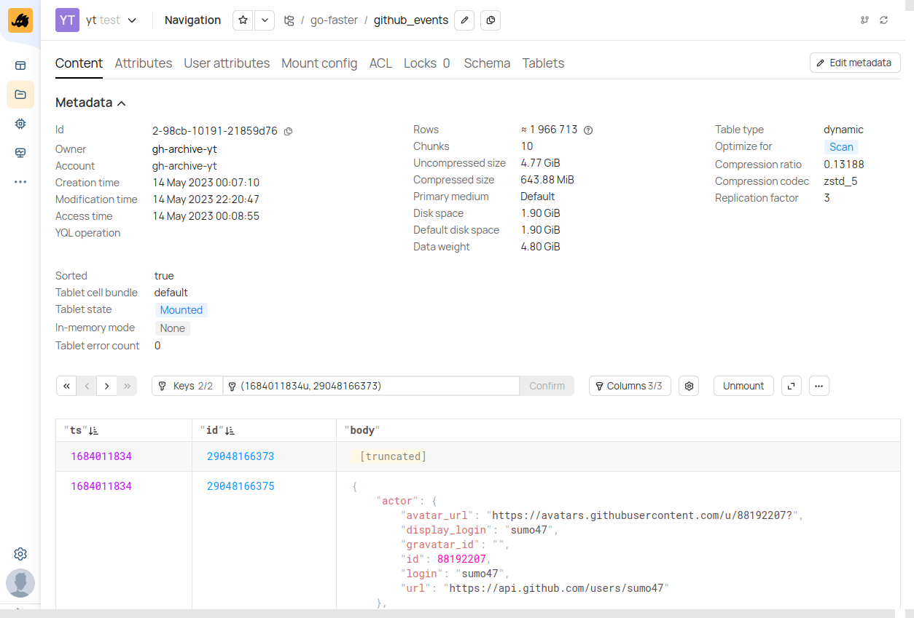

# gh-archive-yt [](https://pkg.go.dev/github.com/go-faster/gh-archive-yt#section-documentation) [](https://codecov.io/gh/go-faster/gh-archive-yt) [](https://go-faster.org/docs/projects/status#experimental)

Archive GitHub events to [YTsaurus](https://ytsaurus.tech/).



## Setup

### Users

```bash
export YT_CONFIG_PATCHES='{proxy={enable_proxy_discovery=%false}}'
export YT_TOKEN=token
export YT_PROXY=http-yt.go-faster.org

yt create user --attr '{name=gh-archive-yt}'
yt issue-token gh-archive-yt
```

Also create account `gh-archive-yt` in UI and set appropriate quotas.

### Directory

```bash
yt create map_node //go-faster --attributes '{owner=gh-archive-yt; account=gh-archive-yt}'
```

### ACL

```bash
cat _hack/acl.yson | yt set //go-faster/@acl
cat _hack/acl.account.yson | yt set //sys/accounts/gh-archive-yt/@acl
```
